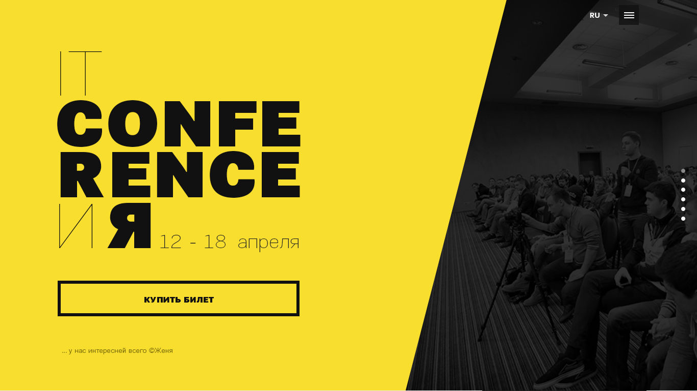

# UaWebChallengeVII task for Middle/Senior frontend dev. PSD to HTML

## Contents
* [Demo](#demo)
* [Test screenshots](#test-screenshots)
* [Folder structure](#folder-sctructure)

###### Technologies: Html5, Jade, Css3, JS, jQuery, Sass, Grunt, Bower.
###### Compatible browsers: IE8+, Firefox, Chrome, Opera, Safari, Yandex.browser


---

## Demo
Live demo: [http://orlovmax.github.io/uawebchallengeVII](http://orlovmax.github.io/uawebchallengeVII "Check the result for UaWebChallenge task")

## Test screenshots
**Browser screenshots [here](https://github.com/orlovmax/uawebchallengeVII/tree/master/test_screenshots/)**

##Folder-structure
```
.
├── Gruntfile.js
├── package.json
├── bower.json
├── README.md
├── Rakefile
├── archives                               result *.zip archive
|   └── project.zip
├── grunt                                  grunt tasks
|   ├── task.js
│   └── aliases.yml 
└── dev
    ├── css                                compiled css
    │   └── screen.css
    ├── img                                image sources
    │   └── *.png, *.jpg, *.gif
    ├── templates                          jade templates
    │   ├── pages                          main pages templates
    │   │   └── index.jade
    │   ├── components                     page components
    │   │   ├── meta.jade, parked
    │   │   └── common                     common page blocks
    │   │       ├── body_src.jade
    │   │       └── head_src.jade
    │   └── helpers                        mixins and vars
    │       └── mixins.jadee
    ├── js                                 scripts
    │   ├── assembled.js
    │   ├── custom.js
    │   ├── head                           head scripts
    │   │   └── head.js
    │   └── vendor                         vendor scripts
    │       └── vendor.js
    ├── styles                             preprocessor styles
    │   ├── screen.sass
    │   └── components                     stylesheet components
    │       ├── _reset.sass
    │       ├── _fonts.sass
    │       └── _block.sass
    ├── html                               compiled html files
    │   └── index.html                     
    ├── helpers                            robots.txt, favicon, etc
    │   └── *.*                            
    ├── fonts                              font sources
    └── devtools                           some developer tools

```  
